# Deep Learning for Computer Vision
## an introduction

**ISAE-SUPAERO, SDD, 18 Nov. 2025**

Florient CHOUTEAU

<!--v-->

Slides : https://fchouteau.github.io/isae-practical-deep-learning/

Notebooks : https://github.com/SupaeroDataScience/deep-learning/tree/main/vision

<!--v-->

6 hours hands-on session to discover deep learning for computer vision

 <!-- .element: height="40%" width="40%" -->

<!--v-->

### Who ?


- **Florient CHOUTEAU**, SDD 2015-2016 🎂
- eXpert in Artificial Intelligence for Space Systems at **Airbus Defence and Space**
- Computer Vision Team (Earth Observation, Space Exploration, Space Domain Awareness)
- Specialized in Satellite Imagery Processing & Deep Learning
- Daily job revolving around Machine Learning + Satellite Imagery
    - Information extraction
    - **Image processing**
    - Research stuff

Any question ? contact me on slack !

PS : I also have an internship open ;)

<!--v-->

# outcomes

- how do we use neural networks when we have image ?
- notions of convolutional neural networks for image classification
- how we use CNNs to analyse and process (satellite) images
- hands-on : perfect your torch / deep learning skills

<!--v-->

This is a "hands-on", not a full class

**Resources on Deep Learning**

- [The Little Book of Deep Learning](https://fleuret.org/francois/lbdl.html)

**Resources on Deep Learning for Computer Vision**

- [Stanford CS231n](http://cs231n.stanford.edu/schedule.html)
- [M2 MVA](...)
- [https://d2l.ai/index.html](https://d2l.ai/index.html)

<!--s-->

# Résumé de l'épisode précédent

<!--v-->

### What you did last time 

- artificial neural networks (mlp) + backpropagation
- first training loops in pytorch on fashion mnist "flattened"
- discovered "callbacks" (early stopping), optimizers (sgd, adam), dropout

<!--v-->

> Artificial neural networks are computational graphs (architectures) that comprised of linear operations with parameters (neurons) and non-linear activation functions

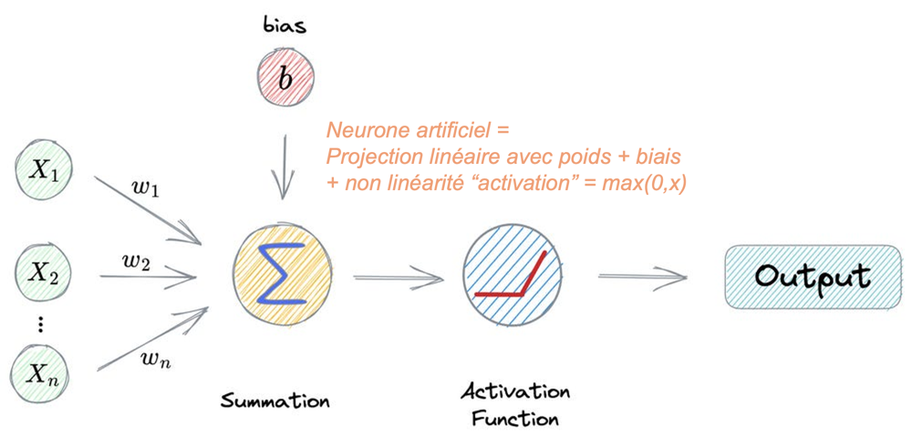  <!-- .element height="50%" width="50%" -->

<!--v--> 

> The parameters (also called weights) of these neural networks can be learned with backpropagation. 

  <!-- .element height="50%" width="50%" -->

<!--v--> 

> Deep Learning is the art of training increasingly more complex (deeper) architectures end-to-end with increasingly more data. 
> 
> Deep Learning allows hierarchical learning of features adapted to the problem

  <!-- .element height="40%" width="40%" -->

<!--v--> 

> Modern tools like pytorch allow you to write and train your architectures without worrying about low-level maths stuff.

  <!-- .element height="50%" width="50%" -->

<!--v--> 

Deep Learning is about scale : of data, of compute, of parameters

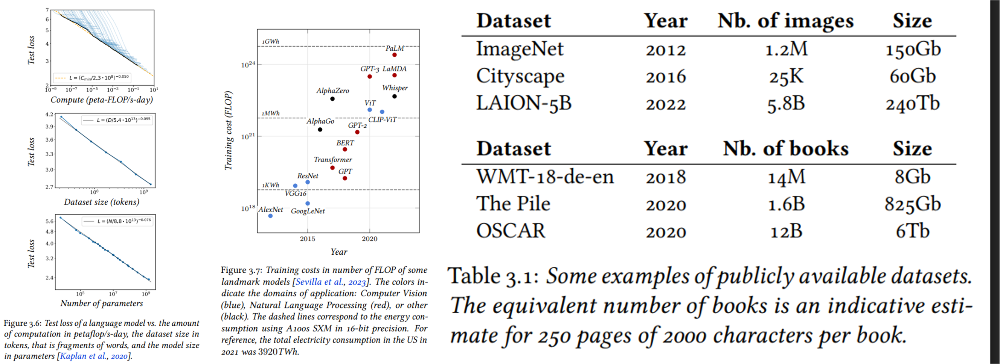  <!-- .element height="75%" width="75%" -->

<!--v--> 

### Deep Learning, with pytorch

  <!-- .element height="50%" width="50%" -->

<!--v-->

### Deep Learning, with pytorch

  <!-- .element height="50%" width="50%" -->


<!--s-->

# Neural Networks 
# for Computer Vision

<!--v-->

**What to do when you have images ?**

 <!-- .element height="50%" width="50%" -->

<!--v-->

**This could work... but is it efficient ?**

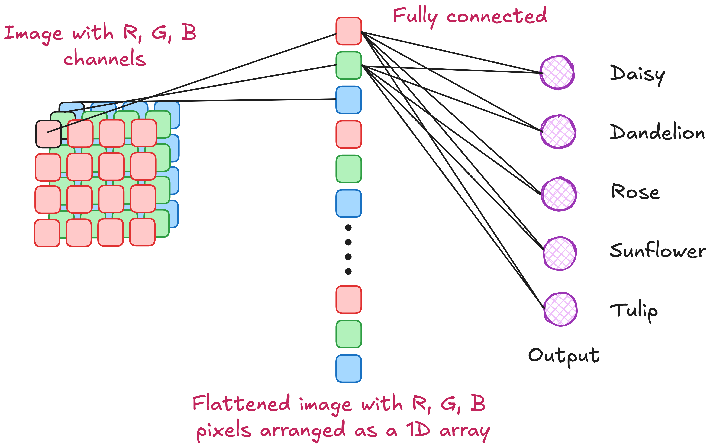 <!-- .element height="50%" width="50%" -->

<!--v-->

**Convolution (1D)**

 <!-- .element height="40%" width="40%" -->

<!--v-->

**Kernel filtering (2D)**

 <!-- .element height="30%" width="30%" -->
<!--v-->

**Kernel filtering (2D)**

 <!-- .element height="30%" width="30%" -->

<!--v-->

**You can hand-craft filters to reach certain effects**

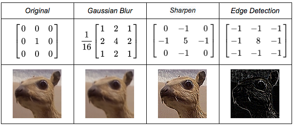 <!-- .element height="60%" width="60%" -->

<!--v-->

**What if we learned the filters ?**

 <!-- .element height="60%" width="40%" -->

<!--v-->

**from learnable MLPs to learnable convolutions**

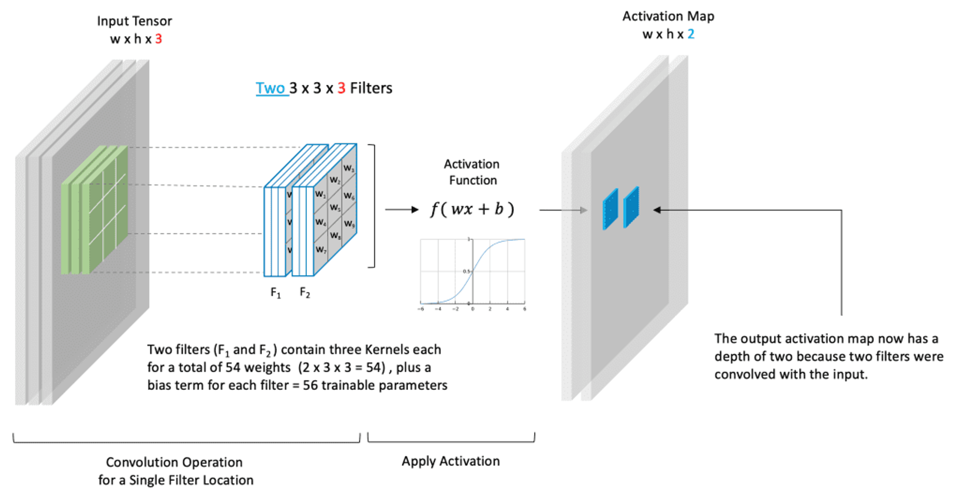 <!-- .element height="50%" width="50%" -->


<!--v-->

**from 2d convolutions to tensorial convolutions**

 <!-- .element height="50%" width="50%" -->

<!--v-->

**Convolutional Neural Networks**

  <!-- .element height="60%" width="60%" -->

<!--v-->

**Convolutions ?**

  <!-- .element height="40%" width="40%" -->

[useful link](https://github.com/vdumoulin/conv_arithmetic)

<!--v-->

**Pooling ?**

 <!-- .element height="40%" width="40%" -->

<!--v-->

**nn.Linear ?**

 <!-- .element height="40%" width="40%" -->

<!--v-->

**Computing shape**

 <!-- .element height="35%" width="35%" -->

<!--v-->

**ConvNets works because we assume inputs are images**

 <!-- .element height="60%" width="60%" -->

<!--v-->

**ConvNets "solved" image classification**

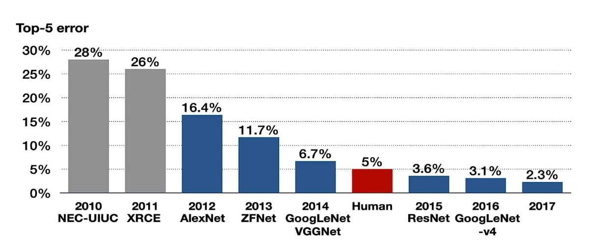 <!-- .element height="60%" width="60%" -->

<!--s--> 

## CNN architectures & Transfer Learning

<!--v--> 

How do I know the number of filters, conv etc for my use case ?

<!--v-->

[VGG16, 2014](https://arxiv.org/abs/1409.1556)

 <!-- .element height="60%" width="60%" -->

<!--v-->

[Residual Networks (ResNets), 2015](https://arxiv.org/abs/1512.03385)

 <!-- .element height="60%" width="60%" -->

<!--v-->

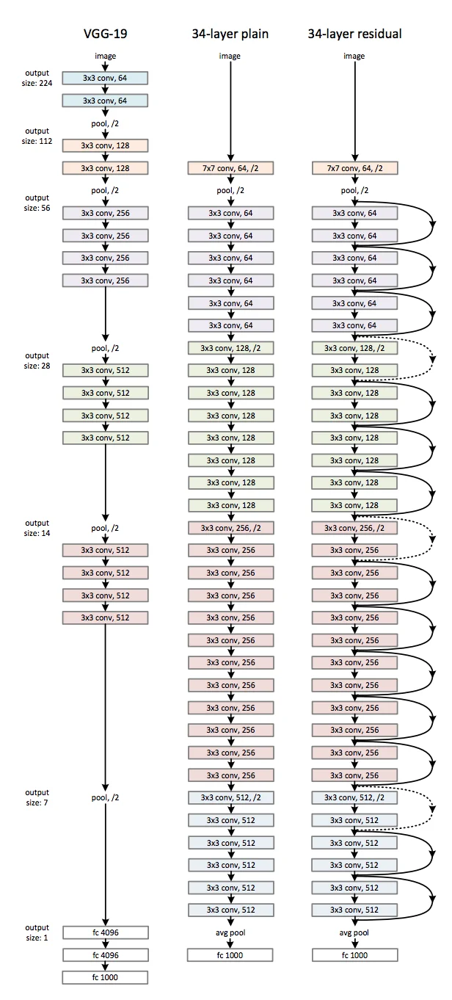 <!-- .element height="50%" width="25%" -->

<!--v-->

🤯


[Well written paper :ConvNext, a ConvNet for the 2020s](https://arxiv.org/abs/2201.03545)

<!--v-->

In practice

 <!-- .element height="35%" width="35%" -->

```text
ResNet(
  (conv1): Conv2d(3, 64, kernel_size=(7, 7), stride=(2, 2), padding=(3, 3), bias=False)
  (bn1): BatchNorm2d(64, eps=1e-05, momentum=0.1, affine=True, track_running_stats=True)
  (relu): ReLU(inplace=True)
  (maxpool): MaxPool2d(kernel_size=3, stride=2, padding=1, dilation=1, ceil_mode=False)
  (layer1): Sequential(
    (0): BasicBlock(
      (conv1): Conv2d(64, 64, kernel_size=(3, 3), stride=(1, 1), padding=(1, 1), bias=False)
      (bn1): BatchNorm2d(64, eps=1e-05, momentum=0.1, affine=True, track_running_stats=True)
      (relu): ReLU(inplace=True)
      (conv2): Conv2d(64, 64, kernel_size=(3, 3), stride=(1, 1), padding=(1, 1), bias=False)
      (bn2): BatchNorm2d(64, eps=1e-05, momentum=0.1, affine=True, track_running_stats=True)
    )
    (1): BasicBlock(
      (conv1): Conv2d(64, 64, kernel_size=(3, 3), stride=(1, 1), padding=(1, 1), bias=False)
      (bn1): BatchNorm2d(64, eps=1e-05, momentum=0.1, affine=True, track_running_stats=True)
      (relu): ReLU(inplace=True)
      (conv2): Conv2d(64, 64, kernel_size=(3, 3), stride=(1, 1), padding=(1, 1), bias=False)
      (bn2): BatchNorm2d(64, eps=1e-05, momentum=0.1, affine=True, track_running_stats=True)
    )
  )
  (layer2): Sequential(
    (0): BasicBlock(
      (conv1): Conv2d(64, 128, kernel_size=(3, 3), stride=(2, 2), padding=(1, 1), bias=False)
      (bn1): BatchNorm2d(128, eps=1e-05, momentum=0.1, affine=True, track_running_stats=True)
      (relu): ReLU(inplace=True)
      (conv2): Conv2d(128, 128, kernel_size=(3, 3), stride=(1, 1), padding=(1, 1), bias=False)
      (bn2): BatchNorm2d(128, eps=1e-05, momentum=0.1, affine=True, track_running_stats=True)
      (downsample): Sequential(
        (0): Conv2d(64, 128, kernel_size=(1, 1), stride=(2, 2), bias=False)
        (1): BatchNorm2d(128, eps=1e-05, momentum=0.1, affine=True, track_running_stats=True)
      )
    )
    (1): BasicBlock(
      (conv1): Conv2d(128, 128, kernel_size=(3, 3), stride=(1, 1), padding=(1, 1), bias=False)
      (bn1): BatchNorm2d(128, eps=1e-05, momentum=0.1, affine=True, track_running_stats=True)
      (relu): ReLU(inplace=True)
      (conv2): Conv2d(128, 128, kernel_size=(3, 3), stride=(1, 1), padding=(1, 1), bias=False)
      (bn2): BatchNorm2d(128, eps=1e-05, momentum=0.1, affine=True, track_running_stats=True)
    )
  )
  (layer3): Sequential(
    (0): BasicBlock(
      (conv1): Conv2d(128, 256, kernel_size=(3, 3), stride=(2, 2), padding=(1, 1), bias=False)
      (bn1): BatchNorm2d(256, eps=1e-05, momentum=0.1, affine=True, track_running_stats=True)
      (relu): ReLU(inplace=True)
      (conv2): Conv2d(256, 256, kernel_size=(3, 3), stride=(1, 1), padding=(1, 1), bias=False)
      (bn2): BatchNorm2d(256, eps=1e-05, momentum=0.1, affine=True, track_running_stats=True)
      (downsample): Sequential(
        (0): Conv2d(128, 256, kernel_size=(1, 1), stride=(2, 2), bias=False)
        (1): BatchNorm2d(256, eps=1e-05, momentum=0.1, affine=True, track_running_stats=True)
      )
    )
    (1): BasicBlock(
      (conv1): Conv2d(256, 256, kernel_size=(3, 3), stride=(1, 1), padding=(1, 1), bias=False)
      (bn1): BatchNorm2d(256, eps=1e-05, momentum=0.1, affine=True, track_running_stats=True)
      (relu): ReLU(inplace=True)
      (conv2): Conv2d(256, 256, kernel_size=(3, 3), stride=(1, 1), padding=(1, 1), bias=False)
      (bn2): BatchNorm2d(256, eps=1e-05, momentum=0.1, affine=True, track_running_stats=True)
    )
  )
  (layer4): Sequential(
    (0): BasicBlock(
      (conv1): Conv2d(256, 512, kernel_size=(3, 3), stride=(2, 2), padding=(1, 1), bias=False)
      (bn1): BatchNorm2d(512, eps=1e-05, momentum=0.1, affine=True, track_running_stats=True)
      (relu): ReLU(inplace=True)
      (conv2): Conv2d(512, 512, kernel_size=(3, 3), stride=(1, 1), padding=(1, 1), bias=False)
      (bn2): BatchNorm2d(512, eps=1e-05, momentum=0.1, affine=True, track_running_stats=True)
      (downsample): Sequential(
        (0): Conv2d(256, 512, kernel_size=(1, 1), stride=(2, 2), bias=False)
        (1): BatchNorm2d(512, eps=1e-05, momentum=0.1, affine=True, track_running_stats=True)
      )
    )
    (1): BasicBlock(
      (conv1): Conv2d(512, 512, kernel_size=(3, 3), stride=(1, 1), padding=(1, 1), bias=False)
      (bn1): BatchNorm2d(512, eps=1e-05, momentum=0.1, affine=True, track_running_stats=True)
      (relu): ReLU(inplace=True)
      (conv2): Conv2d(512, 512, kernel_size=(3, 3), stride=(1, 1), padding=(1, 1), bias=False)
      (bn2): BatchNorm2d(512, eps=1e-05, momentum=0.1, affine=True, track_running_stats=True)
    )
  )
  (avgpool): AdaptiveAvgPool2d(output_size=(1, 1))
  (fc): Linear(in_features=512, out_features=2, bias=True)
)
```
<!--v-->

Introducing [timm](https://github.com/huggingface/pytorch-image-models)

 <!-- .element height="60%" width="60%" -->

<!--v-->

Transfer Learning

 <!-- .element height="60%" width="60%" -->

<!--v-->

Finetuning

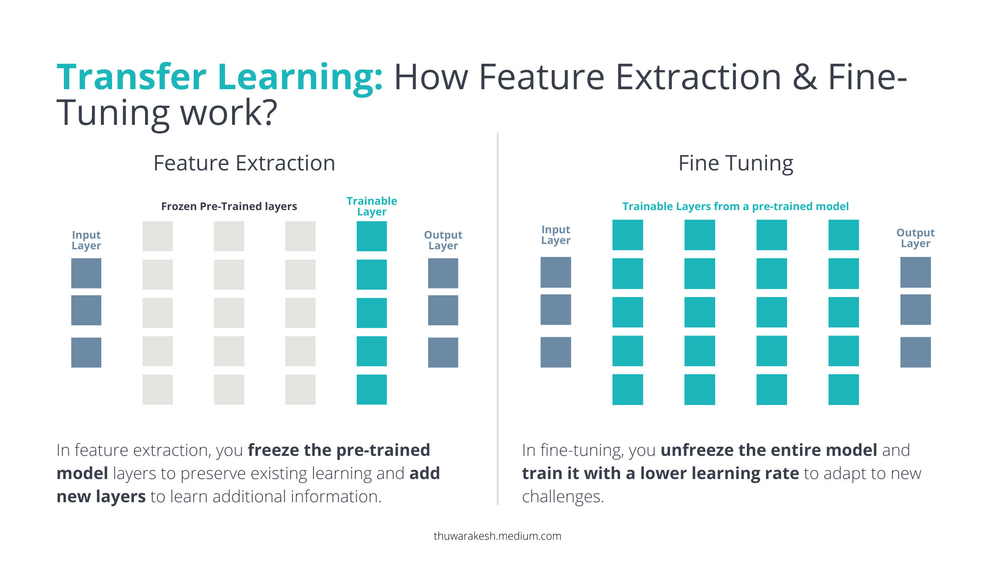 <!-- .element height="60%" width="60%" -->
- Transfer learning : We take the features as is, and freeze the "encoder's" layers
- Finetuning : Usually we don't freeze all weights

<!--v-->

### References

- [Understand Convolutional Neural Networks](https://learnopencv.com/understanding-convolutional-neural-networks-cnn/)
- [Convolution Arithmetics](hub.com/vdumoulin/conv_arithmetic?tab=readme-ov-file)

<!--s-->

# Hands-on 1 : CNNs and Classification

<!--v-->

### Objectives

- Launch notebooks on Colab
- Build an intuition over convolutions and CNNs
- Train a basic CNN on a small training set
- Plot the metrics & ROC curve on a small test set
- Discover the world of hyperparameter tuning

<!--v-->

### Outcomes

- Build an intuition over convolutions and CNNs for image processing
- Handle a dataset of images, do some basic data exploration
- Train & evaluate your first CNN on a simple dataset
- Go beyound accuracy to diagnose your model

<!--v-->

### Context: Earth Observation

  <!-- .element:  width="60%" height="60%"-->

<!--v-->

### Context: DL on Satellite Imagery

A lot of use cases :

- Land Use / Land Cover cartography
- Urban Cartography (building, roads, damage assessment...)
- Various objects detections (ships, vehicles...)

 <!-- .element:  width="60%" height="60%"-->

<!--v-->

### Context: DL on Satellite Imagery

Can also be used for "image processing" : 

- Denoising
- Super Resolution

 <!-- .element:  width="20%" height="20%"-->

<!--v-->

### Context: Needles in haystacks

  <!-- .element:  width="40%" height="40%"-->

<!--v-->

### Context: Cloud Detection

  <!-- .element:  width="40%" height="40%"-->

<!--v-->

### Context: Cloud Detection

  <!-- .element:  width="25%" height="20%"-->

<!--v-->

### Dataset description

- 12800 train images (6400 cloudy, 6400 clear), size 64x64
- 640 test images (320 cloudy, 320 clear), size 64x64

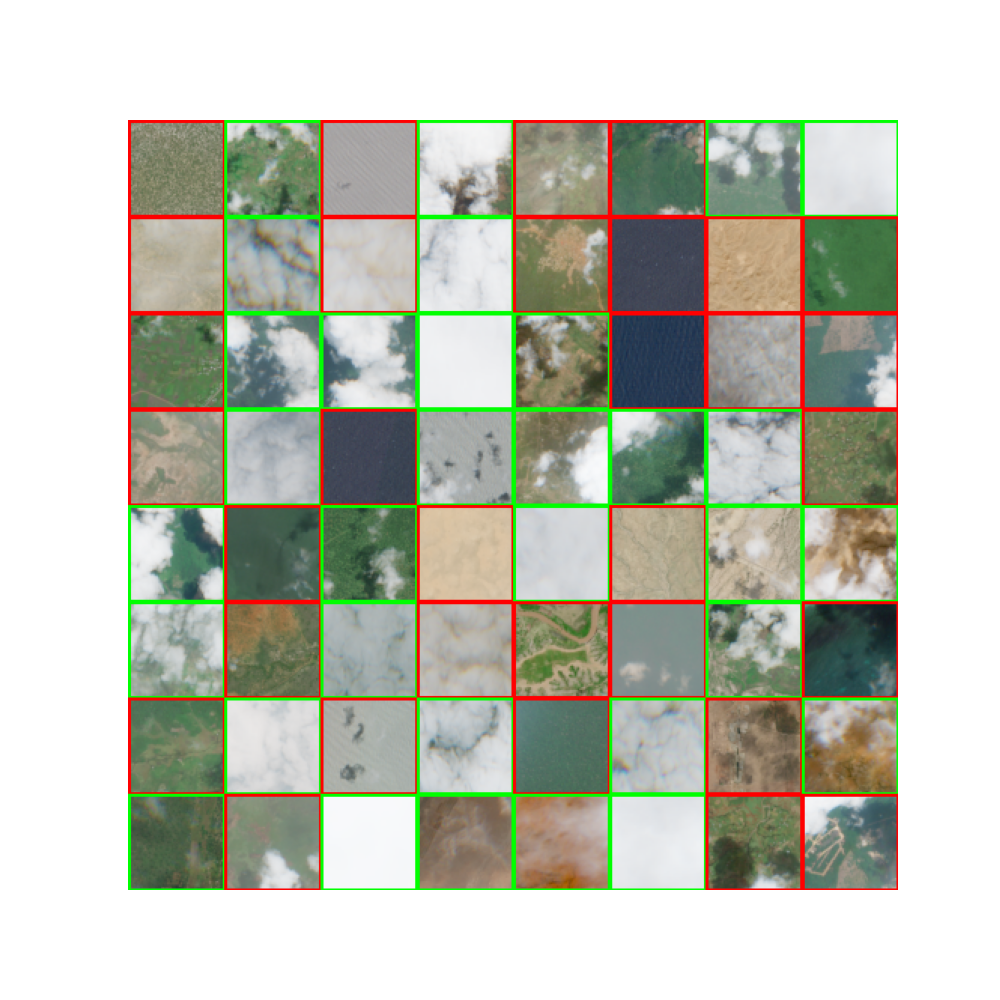 <!-- .element height="40%" width="40%" -->

<!--v-->

### Dataset description

- 64 big test images (256x256)

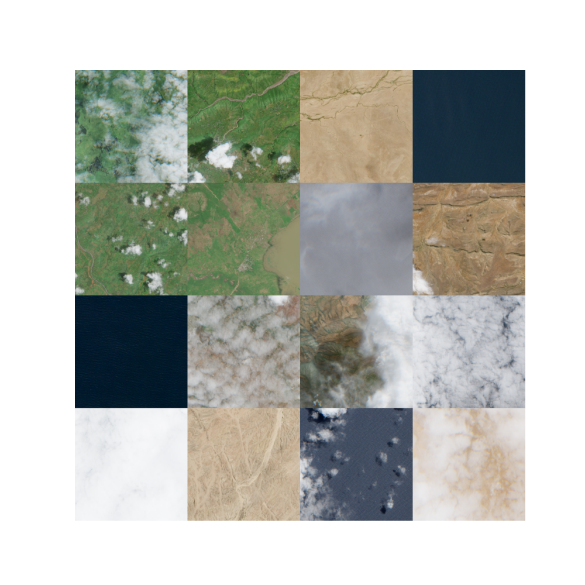 <!-- .element height="40%" width="40%" -->

<!--v-->

### Let's go ! 

- 0_cnns.ipynb : You will get a grasp in image, convolutions and CNNs
- 1_hands_on.ipynb : Train our first cloud detector using CNNs
- 2_sliding_window.ipynnb : How to apply our detector to a big satellite image ?

<!--v-->

### Let's go ! 

1. Go to google colab
2. Import the first notebook & follow the guidelines
3. ...
4. Profit !
5. If you're done... go to the next notebook !

<!--v-->

### Colab Guide

<video data-autoplay  controls width="720">
    <source src="https://storage.googleapis.com/fchouteau-isae-deep-learning/static/colab_guide_proper.mp4" type="video/mp4">
</video>

<!--v-->

### GPU ???

 <!-- .element height="50%" width="50%" -->

<!--v-->

### GPU ???

 <!-- .element height="50%" width="50%" -->

<!--v-->

### GPU ???

[Tutorial](http://d2l.ai/chapter_appendix-tools-for-deep-learning/colab.html)

<!--s-->

## Extra : From CNN to Transformers

<!--v-->

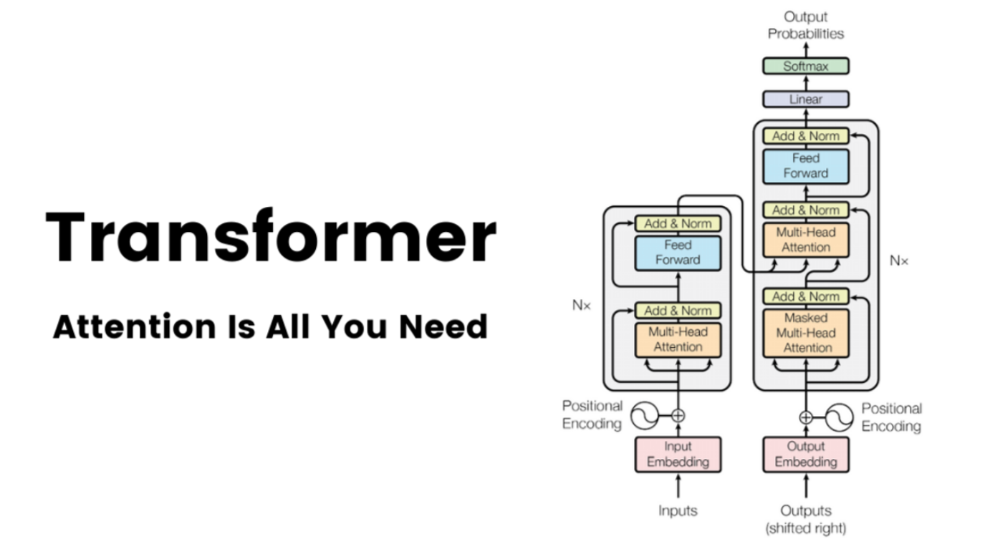 <!-- .element height="50%" width="50%" -->

<!--v-->

 <!-- .element height="50%" width="50%" -->

[An Image is Worth 16x16 Words](https://arxiv.org/abs/2010.11929)

<!--v-->

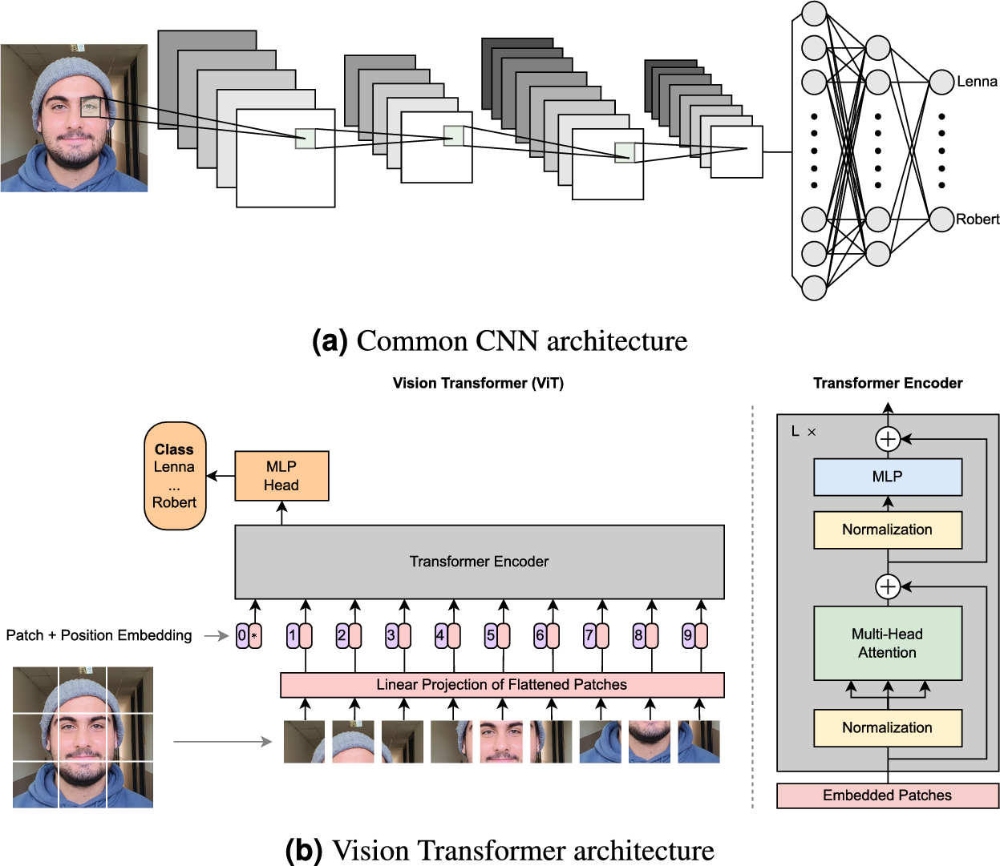  <!-- .element: style="width: 60%; height: 40%"-->

<!--v-->

RIP inductive biases


<!--v-->

Links

https://lbourdois.github.io/blog/nlp/Transformer/
https://nlp.seas.harvard.edu/annotated-transformer/
https://cs231n.stanford.edu/slides/2024/lecture_8.pdf

<!--v-->

[example use case](https://www.picsellia.com/post/are-transformers-replacing-cnns-in-object-detection)


<!--s-->

## Extra
## Diagnosing Classifier performance

<!--v-->

### Binary classification metrics


<!--v-->

### The ROC Curve


<!--v-->

### The ROC curve (visualized)


The shape of an ROC curve changes when a model changes the way it classifies the two outcomes.

<!--v-->

### How to compute a ROC curve ?

  <!-- .element height="40%" width="40%" -->

- y_pred = a list of probas, y_true = a list of 0 or 1
- vertical line : threshold value
- red dot : FPR and TPR for the threshold
- the curve is plotted for all available thresholds

<!--v-->

### Precision & Recall

Usually the most important things in imbalanced classification

  <!-- .element height="40%" width="40%" -->

<!--v-->

### PR synthetic metric

 <!-- .element height="35%" width="35%" -->

- beta = 1 => Recall & Precision weighted equally
- beta > 1 => Emphasizes recall (not missing positive examples)
- beta < 1 => Emphasizes precision (not doing )

<!--v-->

### The PR Curve

 <!-- .element height="75%" width="75%" -->

<!--v-->

### The PR Curve (visualized)


The shape of the precision-recall curve also changes when a model changes the way it classifies the two outcomes.

<!--v-->

### Precision-Recall or ROC ?

- Both curve can be used to select your trade-off
- Precision-recall curve is more sensitive to class imbalance than an ROC curve
- Example: Try computing your FPR on very imbalanced dataset

  <!-- .element height="50%" width="50%" -->

<!--v-->

### Curves Usage: Selecting trade-off

  <!-- .element height="70%" width="70%" -->

<!--v-->

Readings:
- https://lukeoakdenrayner.wordpress.com/2018/01/07/the-philosophical-argument-for-using-roc-curves/
- https://towardsdatascience.com/on-roc-and-precision-recall-curves-c23e9b63820c

<!--s-->

## Extra : Pytorch Ecosystem

<!--v-->

### high-level frameworks over pytorch

- pytorch: define your models, autodifferenciation, **but you write the rest**
- hl library: training loops, callbacks, distribution etc...

  <!-- .element height="50%" width="50%" -->

<!--v-->

### high-level frameworks over pytorch

 <!-- .element height="40%" width="40%" -->

<!--v-->

###  <!-- .element:  width="15%" height="15%"-->

- [pytorch-ignite](https://github.com/skorch-dev/skorch) : a high-level deep learning library based on top of pytorch
- Reduce boilerplate code (training loops, early stopping, logging...)
- Extensible, based on experiment management

<!--v-->

### Pytorch Ecosystem 

- There are other high-level frameworks based on pytorch: [Skorch](https://github.com/skorch-dev/skorch), [Lightning](https://github.com/williamFalcon/pytorch-lightning). 
- All of them have their pros and cons
- [There is a huge ecosystem based around pytorch](https://pytorch.org/ecosystem/)

 <!-- .element: style="width: 25%; height: 25%"--> 

